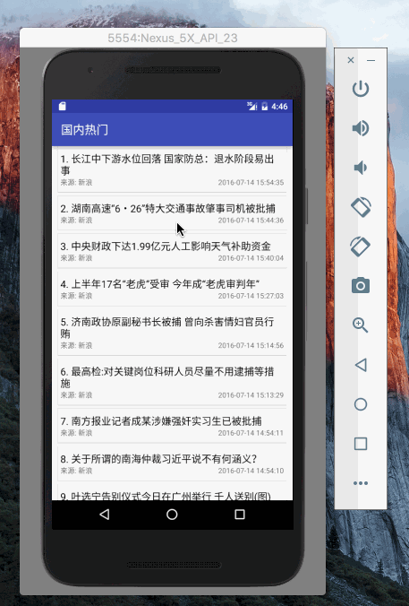

# 项目说明
安卓开发demo: 新闻客户端

最新的demo可以扫下面的二维码安装测试包

# 功能点

1. 通过公共api[频道新闻API_易源](http://apistore.baidu.com/apiworks/servicedetail/688.html),获取新闻频道列表以及各个频道的新闻信息
2. 通过RecyclerView展示新闻列表,下拉刷新,上拉加载更多
3. 左滑显示导航栏,点击可切换各个频道
4. 点击某个新闻标题,可以打开对应的新闻网页查看新闻